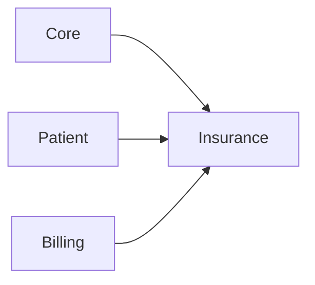

# Insurance module

**In one sentence:** The Insurance module handles multi-payer coverage, claims submission, and claims feedback so billing can be reconciled against what insurers approve or reject.

## Why this module exists

Hospitals in mixed-payment environments (cash + national insurance + private insurance) need one workflow to:

- manage payer rules and policy links,
- submit claims,
- receive feedback from payers,
- and reconcile claim decisions with billing outcomes.

This module centralizes that lifecycle.

## Where Insurance fits in FlowRise

- Connects **Patient** policies to payer coverage.
- Connects **Billing** invoice lines to claim lines and adjudication outcomes.
- Uses **Core** contracts/services for shared pricing resolution interfaces.

## Current status

**Complete** for operational claims workflows (verified against code 2026-09-20). Built: NHIS claim batch generation with pre-flight report, vetting and NHIA v8.6 XML export, NHIA feedback XML import, NHIA **OTAC** claim-check-code generation (settings, hourly token refresh, `NhisAttendanceService` used by Clinical encounters), master-data Filament resources (tariff books with tariff-item relation manager, NHIS medicines, G-DRG/ICD map, members master, provider credentialing), member verification (offline members master; badge on the patient list and Patient Profile), patient insurance fields on the patient form, `insurance:import-master-data` command. Deferred: NHIS catalog sync implementation (`processed: 0` from connector paths), dedicated PatientPolicy Filament resource (the patient record has a read-only **Insurance Policies** tab via `PatientPoliciesRelationManager`), private insurer connector beyond the generic stub. HTTP claim submission for the NHIS payer was removed on 2026-09-02; NHIS claims are file-export only.

See [module status](../../docs/shared/module-status.md) for the canonical matrix.

## What you can do with it

- Work in the **Insurance** cluster (Finance sidebar group, `/insurance-cluster`): **Claims** (claim batches: Generate Claims page, Pre-flight Report, Submit All / Vet, Export XML, Download XML once exported, Claims in Batch tab with Review / Mark Ready), **Payers** (a second NHIS payer cannot be created; the seeded NHIS payer is system-managed via `Payer::isSystem()` — type locked, delete refused by policy, model and UI), master data under the Infrastructure sub-group (**NHIS medicines**, **Tariff books** with tariff items, **Members master**, **Provider credentialing**, **G-DRG / ICD map**), **Import NHIA Feedback** (Administration sub-group) and **NHIS Settings** (Settings sub-group, incl. Test OTAC Connection). The patient record gets a read-only **Insurance Policies** relation manager (`Filament/RelationManagers/PatientPoliciesRelationManager`).
- Record NHIS membership on the patient form (Insurance Information: Insurance Payer, Member Number, and Mother Member Number once a payer is chosen; the effective-date fields are defined but hidden) and see the **NHIS Member** verification badge on the patient list / profile.
- Generate NHIS claim check codes on encounters (auto via OTAC when the encounter is saved with NHIS coverage, or manual entry; the **Generate NHIS Claim Code** button only renders for NHIS-covered, uncompleted encounters without a code).
- Submit **private insurer** claims through the authenticated API endpoint and process payer feedback / reconcile statuses (generic connector stub).
- **NHIS claims workflow:** filter encounters (branch, patient, year, month, service, medication, or all eligible) → generate batch → pre-flight → review / Mark Ready or Submit All / Vet → export NHIA v8.6 XML → upload to Claim-It → import NHIA feedback XML.

## How it works (simple)

1. A patient policy links a patient to a payer/coverage context.
2. Billing-generated lines are transformed into claim lines.
3. Claims are submitted through connector services (NHIS/private).
4. Feedback is ingested and persisted idempotently.
5. Reconciliation services update decision state and downstream financial expectations.

## API endpoints

- `POST /api/v1/insurance/catalog/sync` (Sanctum + `api.branch`; connector placeholder returns `processed: 0`)
- `POST /api/v1/insurance/claims/submit` (Sanctum + `api.branch`; rejects the NHIS payer with 422 — use the batch XML export)
- `POST /api/v1/insurance/claims/feedback` (no auth; shared secret `NHIS_FEEDBACK_SECRET`)

## What is inside this folder

| Path | Purpose |
|------|---------|
| `app/Models/` | `Payer`, `PatientPolicy`, `ClaimBatch`, `InsuranceClaim`, `InsuranceClaimLine`, `InsuranceClaimSubmission`, `InsuranceClaimFeedback`, `InsuranceCatalogSync`, `NhisMedicine`, `TariffBook`, `TariffItem`, `MembersMaster`, `ProviderCredentialing`, `GdrgIcdMap` (14 models, 6 migrations). |
| `app/Services/` | `ClaimBatchService`, `ClaimGenerationService`, `ClaimSubmissionService`, `ClaimReconciliationService`, `NhisFeedbackImportService`, `MemberVerificationService`, `PatientInsuranceService`, `CatalogSyncService`, `DefaultInsurancePricingService`, `PayerConnectorRegistry`, `Otac/` (OTAC client, `NhisAttendanceService`). |
| `app/Services/Connectors/` | `Nhis/` (batch XML encoder, feedback parser) and `PrivateInsurer/` connector implementations. |
| `app/Schemes/Nhis/` | `NhisSchemeHandler` (scheme enable checks). |
| `app/Jobs/` | `SubmitInsuranceClaimJob`, `PollInsuranceClaimFeedbackJob` (queues `INSURANCE_CLAIMS_QUEUE`, `INSURANCE_CATALOG_QUEUE`). |
| `app/Console/` | `insurance:import-master-data {type} {file}` (medicines, members, credentialing, annex-c, tariff), `insurance:otac-refresh-token` (scheduled hourly). |
| `app/Settings/InsuranceSettings.php` | NHIS Settings page values (module/NHIS/private/pricing/catalog-sync toggles, accreditation and eClaim numbers, speciality code, master table versions, claim-check-code requirement, prescribing level, member verification mode, OTAC credentials). |
| `app/Filament/` | `InsuranceCluster`, resources (ClaimBatches with Generate/Pre-flight pages, InsuranceClaimResource "Claim Review" hidden from nav, Payers, MasterData/*), pages (NhiaFeedbackImport, ManageInsuranceSettings), `Schemas/PatientInsuranceSchema` (fields injected into the patient form), exporters. |
| `app/Contracts/` | Pricing and connector contracts. |
| `app/Http/Controllers/Api/` | Claims/catalog API handlers. |
| `app/Providers/` | Module registration and relation wiring. |
| `database/` | 14 factories; seeders `InsuranceDatabaseSeeder` (payers `nhis`, `private-generic`, medicines list), `NhisMedicinesList2025Seeder`, `NhisClaimsDemoSeeder`; `data/nhis_medicines_list_2025.csv`; `scripts/extract_nhis_ml_2025.py`. |

## Dependencies

- `flowrise-hms/core`
- `flowrise-hms/patient`
- `flowrise-hms/billing`

See [module status](../../docs/shared/module-status.md) for current rollout state.

## Further reading

- **Admin setup:** [Insurance Administration](../../docs/admin-guide/insurance.md)
- **Billing context:** [Billing Workflows](../../docs/user-guide/billing.md)

## For developers

- **Namespace:** `Modules\Insurance\...`
- **Service provider:** `Modules\Insurance\Providers\InsuranceServiceProvider`
- Provider wiring includes:
  - `InsurancePricingResolver` -> `DefaultInsurancePricingService`
  - dynamic relations: `Patient::insurancePolicies` and `InvoiceLine::insuranceClaimLines`
- NHIS claims are batch-export-only (v8.6 XML via `NhisBatchXmlEncoder` for CLAIM-it upload); feedback imports use `NhisFeedbackParser`.
- Env keys: `INSURANCE_MODULE_ENABLED`, `NHIS_FEEDBACK_SECRET`, `NHIS_XML_VERSION` (8.6), `NHIS_OTAC_BASE_URL`, `NHIS_OTAC_TIMEOUT`, `INSURANCE_CLAIMS_QUEUE`, `INSURANCE_CATALOG_QUEUE`.
- Permissions: Shield abilities on ClaimBatch, InsuranceClaim, Payer, NhisMedicine, TariffBook, MembersMaster, ProviderCredentialing, GdrgIcdMap plus `View InsuranceCluster` and page permissions; no custom snake_case permissions.
- Tests: `php artisan test --compact Modules/Insurance/tests` (32 test files).

