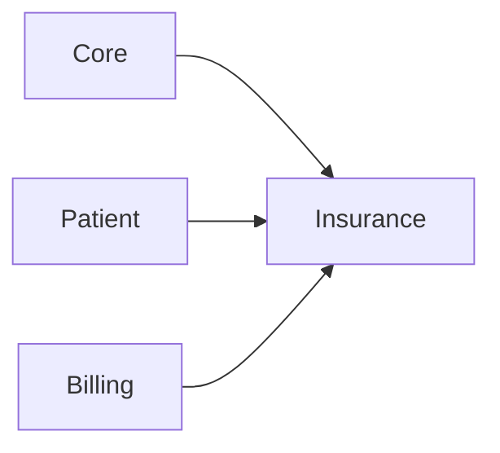

# Insurance module

**In one sentence:** The Insurance module handles multi-payer coverage, claims submission, and claims feedback so billing can be reconciled against what insurers approve or reject.

## Why this module exists

Hospitals in mixed-payment environments (cash + national insurance + private insurance) need one workflow to:

- manage payer rules and policy links,
- submit claims,
- receive feedback from payers,
- and reconcile claim decisions with billing outcomes.

This module centralizes that lifecycle.

## Where Insurance fits in FlowRise

- Connects **Patient** policies to payer coverage.
- Connects **Billing** invoice lines to claim lines and adjudication outcomes.
- Uses **Core** contracts/services for shared pricing resolution interfaces.

## What you can do with it

- Manage payers, tariffs, patient policies, and claim records through services and API endpoints.
- Use the **Payers** Filament resource for payer administration.
- Submit claims through authenticated API endpoints.
- Process payer feedback and reconcile statuses.
- Support both NHIS-specific XML workflows and private insurer connectors.
- **NHIS claims workflow:** filter encounters → generate batch → review/vet claims → export NHIA v8.6 XML for Claim-It upload.

## How it works (simple)

1. A patient policy links a patient to a payer/coverage context.
2. Billing-generated lines are transformed into claim lines.
3. Claims are submitted through connector services (NHIS/private).
4. Feedback is ingested and persisted idempotently.
5. Reconciliation services update decision state and downstream financial expectations.

## API endpoints

- `POST /api/v1/insurance/catalog/sync` (authenticated)
- `POST /api/v1/insurance/claims/submit` (authenticated)
- `POST /api/v1/insurance/claims/feedback`

## What is inside this folder

| Path | Purpose |
|------|---------|
| `app/Models/` | Payers, policies, claims, claim lines, submissions, feedback. |
| `app/Services/` | Submission, reconciliation, connector registry, catalog sync. |
| `app/Services/Connectors/` | NHIS and private insurer connector implementations. |
| `app/Jobs/` | Async claim submit and feedback polling workflows. |
| `app/Contracts/` | Pricing and connector contracts. |
| `app/Http/Controllers/Api/` | Claims/catalog API handlers. |
| `app/Providers/` | Module registration and relation wiring. |

## Dependencies

- `flowrise-hms/core`
- `flowrise-hms/patient`
- `flowrise-hms/billing`

See [module status](../../docs/shared/module-status.md) for current rollout state.

## Further reading

- **Admin setup:** [Insurance Administration](../../docs/admin-guide/insurance.md)
- **Billing context:** [Billing Workflows](../../docs/user-guide/billing.md)

## For developers

- **Namespace:** `Modules\Insurance\...`
- **Service provider:** `Modules\Insurance\Providers\InsuranceServiceProvider`
- Provider wiring includes:
  - `InsurancePricingResolver` -> `DefaultInsurancePricingService`
  - dynamic relations: `Patient::insurancePolicies` and `InvoiceLine::insuranceClaimLines`
- NHIS path uses `NhisXmlEncoder`, `NhisConnector`, and `NhisFeedbackParser`.

